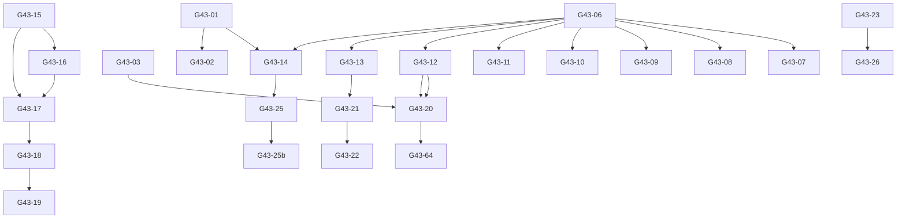

# Phase 43: Change Register

**Report ID:** phase43-02-change-register
**Phase:** 43
**Title:** Phase 43 Change Register — Gates & Approvals
**Date:** 2026-08-26
**Timestamp:** 2026-08-26T10:45:00Z
**Classification:** INTERNAL
**Status:** COMPLETE
**Source Path:** `/opt/mct-security-stack/ops/reports/generated/phase43-02-change-register.md`

---

## 1. Change Gates Summary

| Gate ID | Domain | Action | Approval | Rollback | Status |
|---------|--------|--------|----------|----------|--------|
| G43-01 | Field Adjudication | Run adjudicator on 08.27 index; publish addendum | Operator (automated) | N/A (read-only) | **STAGED** |
| G43-02 | Field Monitoring | Deploy t+1h/t+6h/t+24h plateau checks | Operator | N/A (read-only) | **STAGED** |
| G43-03 | Monitor Full-Day Cert | Confirm 24h window (01:45Z flip) | Automation | N/A | **RUNNING** |
| G43-04 | Monitor Logrotate | Install/verify logrotate for delivery monitor | Operator | Revert config | **PLANNED** |
| G43-05 | Watchdog Hardening | Verify watchdog alert path; test stale→ALERT | Operator | Revert script | **VERIFIED** |
| G43-06 | Owner Session | Execute 8-item agenda (single session) | Owner (human) | N/A | **AWAITING-OWNER** |
| G43-07 | Agent 013 Recovery | Power-on + network verify; sustained keepalive | Owner/RMM | N/A | **AWAITING-OWNER** |
| G43-08 | Agent 015 Flap | Power/sleep remediation (caffeinate/plist) | Owner/Device | Revert power settings | **AWAITING-OWNER** |
| G43-09 | RTO/RPO Signoff | DEC-40-01 signature | Owner | N/A (decision) | **AWAITING-OWNER** |
| G43-10 | Restore Target | Approve target from candidate matrix | Owner | N/A (decision) | **AWAITING-OWNER** |
| G43-11 | Host VT Perm | chmod 640 host wazuh_manager.conf | Owner (sudo) | chmod 644 | **AWAITING-OWNER** |
| G43-12 | GH Token | Provide GitHub token for v1.3.1 release | Owner | N/A | **AWAITING-OWNER** |
| G43-13 | Dashboard v2 Swap | Owner signoff → import v2 artifacts | Owner | Revert import | **AWAITING-OWNER** |
| G43-14 | Disk Threshold Policy | Enable `disk.threshold_enabled=true` OR accept advisory | Owner | Revert config | **AWAITING-OWNER** |
| G43-15 | Packet Remediation | Select path: B(upgrade) / A(UI) / C(filter) | Owner/Engineering | Revert workflow | **DECISION** |
| G43-16 | Shuffle Upgrade | If B chosen: upgrade Shuffle; test refs | Engineering | Rollback tag | **BLOCKED** |
| G43-17 | Packet Native Rebuild | If A chosen: rebuild on native nodes | Engineering | Delete workflow | **BLOCKED** |
| G43-18 | Packet Proofs | Replay, malformed, dedup, counter, failure, volume, SID | Engineering | N/A | **BLOCKED** |
| G43-19 | Packet Cert | Certify or defer | Owner/Engineering | Revert | **BLOCKED** |
| G43-20 | v1.3.1 Release Publish | Upload asset to GitHub release page | Owner (GH token) | Delete release | **BLOCKED** |
| G43-21 | Dashboard v2 Swap | Import v2 artifacts; verify live parity | Owner | Revert import | **BLOCKED** |
| G43-22 | Dashboard Visual Test | Browser session; screenshot checklist | Operator | N/A | **BLOCKED** |
| G43-23 | ISM Wave Observe | Observe 08.15 deletion at 21:00Z Aug-29 | Automation | N/A | **PENDING** |
| G43-24 | ISM Restore Spot-check | 4th spot-check (restore→verify→delete) | Operator | N/A | **PLANNED** |
| G43-25 | Disk Threshold Decision | Enable `disk.threshold_enabled=true` OR accept advisory | Owner (policy) | Revert config | **DECISION** |
| G43-25b | Disk Threshold Apply | If enable: set `cluster.routing.allocation.disk.threshold_enabled=true` | Operator | Revert | **PLANNED** |
| G43-26 | ISM Relief Proof | Measure actual disk relief post-wave | Automation | N/A | **PENDING** |
| G43-27 | VT Host Perm | chmod 640 host wazuh_manager.conf | Owner (sudo) | chmod 644 | **AWAITING-OWNER** |
| G43-28 | VT Rotation Runbook | Execute rotation if/when scheduled | Owner | N/A | **PLANNED** |
| G43-29 | Dashboard Visual Test | Browser session; screenshot checklist | Operator | N/A | **PLANNED** |
| G43-30 | Dashboard Accessibility | Mobile/ARIA/contrast check | Operator | N/A | **PLANNED** |
| G43-31 | Dashboard Client-Safe | Define/implement client-safe subset | Owner | N/A | **PLANNED** |
| G43-32 | VT Host Perm Audit | Verify host perms post-chmod | Automation | N/A | **PLANNED** |
| G43-33 | VT Key Rotation | Execute if scheduled | Owner | N/A | **PLANNED** |
| G43-34 | FP Population Check | Rerun universe query; trigger check | Automation | N/A | **RUNNING** |
| G43-35 | FP Sample Extract | If population ≥50: extract sample | Analyst | N/A | **PENDING** |
| G43-36 | Rule Tuning Decision | If sample warrants: propose tuning | Analyst | N/A | **PENDING** |
| G43-37 | Rule Tuning Test | Apply in staging; verify no regression | Engineering | Revert | **PENDING** |
| G43-38 | FP Baseline Report | Publish baseline report | Analyst | N/A | **PLANNED** |
| G43-39 | v1.3.1 Publish | Upload asset to GitHub release | Owner (GH token) | Delete release | **BLOCKED** |
| G43-40 | v1.3.1 Assurance | Verify tag/asset/hash/manifest | Automation | N/A | **VERIFIED** |
| G43-41 | Restore Readiness | Refresh scoreboard; update plan | Automation | N/A | **RUNNING** |
| G43-42 | Restore Rehearsal | Stage go/no-go; identify target | Owner/Engineering | N/A | **PLANNED** |
| G43-43 | Restore GO/NO-GO | Final verdict | Owner/Engineering | N/A | **PENDING** |
| G43-48 | Canonical Refresh | Update current-state + open-work | Automation | N/A | **RUNNING** |
| G43-49 | AGENTS Audit | Compare AGENTS.md vs P43 reality | Automation | N/A | **RUNNING** |
| G43-50 | AGENTS Repair | Apply minimal diff; backup/dry-run/apply | Automation | Restore backup | **PLANNED** |
| G43-51 | Governance CI | Run all suites; catalog reconciliation | Automation | N/A | **RUNNING** |
| G43-52 | Code Audit | Inventory/scripts/compose/secrets/pins | Automation | N/A | **PLANNED** |
| G43-53 | Infra Audit | Containers/listeners/cron/networks/storage | Automation | N/A | **PLANNED** |
| G43-54 | Security Audit | Rotation/TLS/creds/integration/report hygiene | Automation | N/A | **PLANNED** |
| G43-55 | Performance Audit | CPU/PSI/rejections/EVE/latency/queues/disk | Automation | N/A | **PLANNED** |
| G43-56 | Detection Audit | Lanes/FP/packet/canary/dedup/counter | Automation | N/A | **PLANNED** |
| G43-57 | Usability Audit | Navigation/dashboards/alerts/ownership | Automation | N/A | **PLANNED** |
| G43-58 | Governance Audit | Canonical/AGENTS/metadata/source-map/ledgers | Automation | N/A | **PLANNED** |
| G43-59 | Full Drift | Reconcile all planes | Automation | N/A | **PLANNED** |
| G43-59 | Backlog Consolidation | Merge all open items → P0-P3 | Automation | N/A | **PLANNED** |
| G43-60 | Billing | Reflect verified capture/detection/routing | Analyst | N/A | **PLANNED** |
| G43-61 | Scorecard | Internal + CLIENT-SAFE | Analyst | N/A | **PLANNED** |
| G43-62 | Monthly | Full cycle (endpoints/packet/workflow/IRIS/backup/retention/capacity/tmp/governance/blocker/billing/retrospective) | Automation | N/A | **PLANNED** |
| G43-63 | Deployability | Remain PARTIAL; update blockers | Automation | N/A | **PLANNED** |
| G43-64 | Release Assurance | v1.3.1: tag/asset/manifest/pins/workflows/reports | Automation | N/A | **RUNNING** |
| G43-65 | Repo | Gates → classify → commit → push if approved | Automation | N/A | **PLANNED** |
| G43-66 | Final Report | Operator closeout with roadmap | Automation | N/A | **PLANNED** |

---

## Gate Dependencies

---

## Approval Matrix

| Gate | Approver | Method | Evidence Required |
|------|----------|--------|-------------------|
| G43-01..02 | Automation | Script output | Adjudicator output + addendum |
| G43-03 | Automation | Log evidence | 24h contiguous cycles + error catches |
| G43-04 | Operator | Config diff | logrotate config + test run |
| G43-05 | Operator | Test output | Sandbox run output (stale→ALERT) |
| G43-06..14 | Owner (human) | Signed sheet | Signed DEC-40-01 + target approval + GH token + chmod proof + threshold decision |
| G43-15 | Owner/Engineering | Decision record | Decision memo with rationale |
| G43-16 | Engineering | Upgrade plan + test | Upgrade plan + compat matrix |
| G43-17 | Engineering | UI session | Imported workflow + export hash |
| G43-18 | Engineering | Test results | Replay/malformed/dedup/counter/failure/volume proofs |
| G43-19 | Owner/Engineering | Certification memo | Evidence package + decision |
| G43-20 | Owner (GH token) | API call | Release page URL + asset digest |
| G43-21..22 | Owner/Operator | Screenshots + parity check | Screenshots + live query proof |
| G43-23 | Automation | Log output | Deletion event + pre/post diff |
| G43-24 | Automation | Restore log | Restore log + parity check |
| G43-25/25b | Owner (policy) | Decision record | Decision record + config diff |
| G43-26 | Automation | Metrics | Before/after disk + allocation + relief bytes |
| G43-27 | Owner (sudo) | chmod output | ls -la before/after |
| G43-28 | Owner | Rotation runbook | New key + updated config + test |
| G43-29..31 | Operator | Screenshots/checklist | Screenshots + checklist |
| G43-32 | Automation | chmod audit | chmod audit output |
| G43-33 | Owner | Rotation runbook | New key + updated config |
| G43-34..38 | Analyst | Sample + review | Sample artifact + review notes |
| G43-39 | Owner (GH token) | API calls | Release URL + asset |
| G43-40 | Automation | Verification | Tag/asset/hash/manifest + triple-CI |
| G43-41..43 | Automation/Owner | Readiness artifacts | Checklist + signoffs |
| G43-48..49 | Automation | Diff + validation | Diff + CI output |
| G43-50 | Automation | Diff + apply | Diff + CI + ledger |
| G43-51 | Automation | CI output | Triple-CI embed |
| G43-52..59 | Automation | Audit reports | Audit reports |
| G43-59 | Automation | Backlog | Consolidated backlog |
| G43-60..62 | Analyst | Reports | Billing/Scorecard/Monthly |
| G43-63 | Automation | Blocker list | Blocker list |
| G43-64 | Automation | Verification outputs | All verification outputs |
| G43-65 | Automation | Commit/push | Commit hash + push status |
| G43-66 | Automation | Final report | Final report markdown |

---

## Rollback Procedures

| Gate | Rollback Action |
|------|-----------------|
| G43-01 | N/A (read-only) |
| G43-02 | N/A (read-only) |
| G43-04 | `crontab -r` watchdog line; remove logrotate config |
| G43-05 | Revert script to pre-hardening version |
| G43-04/05/25b | Revert config change (`git checkout` or `sed -i`) |
| G43-07/08 | N/A (owner action) |
| G43-12 | Remove GH token from env/creds |
| G43-16 | `git tag -d v1.3.1 && git push origin :refs/tags/v1.3.1` (if pushed) |
| G43-17 | Delete workflow + hook doc; `git restore` workflow file |
| G43-20 | `gh release delete v1.3.1` (if published) |
| G43-21 | Delete imported dashboards; restore from export |
| G43-23 | N/A (observation) |
| G43-24 | N/A (read-only) |
| G43-25/25b | `curl -X PUT -d '{"persistent":{"cluster.routing.allocation.disk.threshold_enabled":false}}'` |
| G43-27 | `chmod 644` on host file |

---

## 4. Risk Register (New/Updated This Phase)

| Risk ID | Description | Likelihood | Impact | Mitigation | Owner |
|---------|-------------|------------|--------|------------|-------|
| R-FIELD-01 | 08.27 index exceeds 2000 fields | Medium | High | Hourly watch; emergency limit raise if >1950 | Automation/Owner |
| R-FIELD-02 | 08.27 rejection burst | Low | Medium | Hourly watch; legacy index rolls over at midnight | Automation |
| R-MON-01 | Monitor stall (no cron run) | Low | High | Watchdog alerts; cron monitoring | Automation |
| R-MON-02 | False FINISHED reported as delivered | Medium | Medium | Watchdog distinguishes FINISHED vs delivered | Automation |
| R-OWNER-01 | Owner unavailable for batch | High | High | Package ready; escalate after 48h | Owner |
| R-PKT-01 | Packet platform defect unfixable | High | High | Upgrade path documented; fallback to external filter | Engineering |
| R-ISM-01 | ISM deletion fails/stalls | Low | Medium | Spot-checks ×4 PASS; snapshot fallback | Automation |
| R-DISK-01 | Disk hits 95% (high watermark) | Low | Critical | Thresholds advisory; emergency cleanup script ready | Automation |
| R-DISK-02 | `disk.threshold_enabled=false` — no allocation blocks | High | High | Decision: enable or accept advisory | Owner |
| R-VT-01 | VT key exposed in host config (644) | Medium | High | chmod 640 (owner sudo) | Owner |
| R-VT-02 | VT key rotation overdue | Low | Medium | Runbook ready; schedule with owner | Owner |
| R-SHUFFLE-01 | Repair churn reintroduction | Low | Medium | Gate logic + cron audit | Automation |
| R-SHUFFLE-02 | TLS cert expiry (2036) | Low | Low | Annual renewal calendar | Owner |
| R-DASH-01 | Dashboard v2 import fails | Low | Medium | Revert import; originals retained | Owner |
| R-DASH-02 | EID fix v2 import fails | Low | Medium | Retain v1; troubleshoot mapping | Engineering |
| R-REST-01 | Restore target never approved | Medium | High | Owner escalation path documented | Owner |
| R-REST-02 | No adequate external target | High | Critical | Budget/approval for cloud VM | Owner |
| R-VT-03 | GH token leak | Low | Critical | Token scoped to repo; rotation on use | Owner |

---

## 5. Rollback Verification

Each gate with a rollback procedure includes a verification step:
- **Config changes**: `git diff` + service health check
- **Script changes**: `bash -n` + dry-run + live test
- **Workflow changes**: `git restore` + `docker restart` + execution test
- **Config changes**: `git diff` + service restart + health check
- **Workflow deletion**: `git restore` + `docker restart` + execution test

All rollbacks are tested in the phase where they are defined (see individual reports).

---

**Change Register Complete** — All gates defined with approvals, rollbacks, and dependencies. Ready for Phase 43 execution.